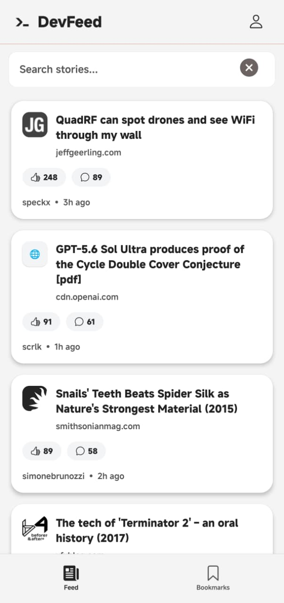
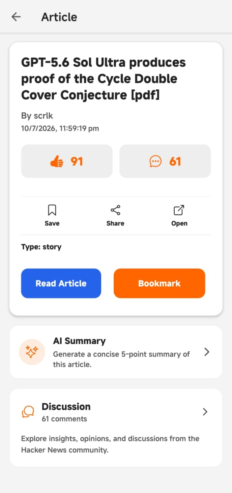
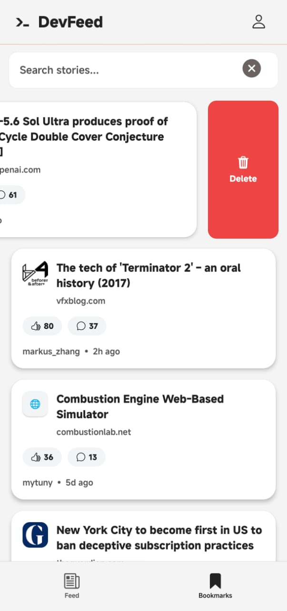
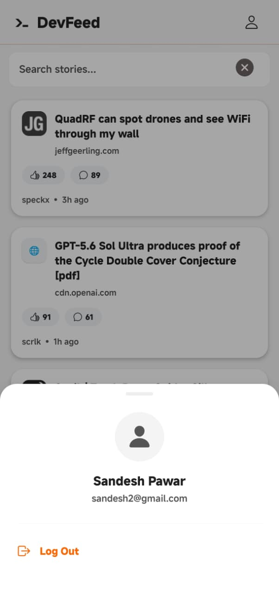
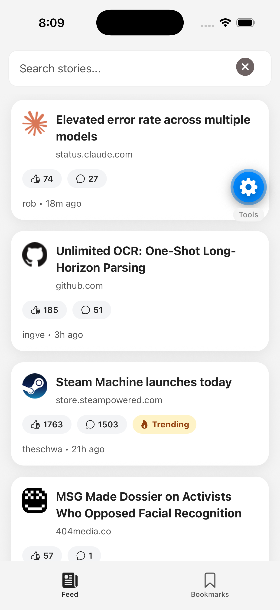
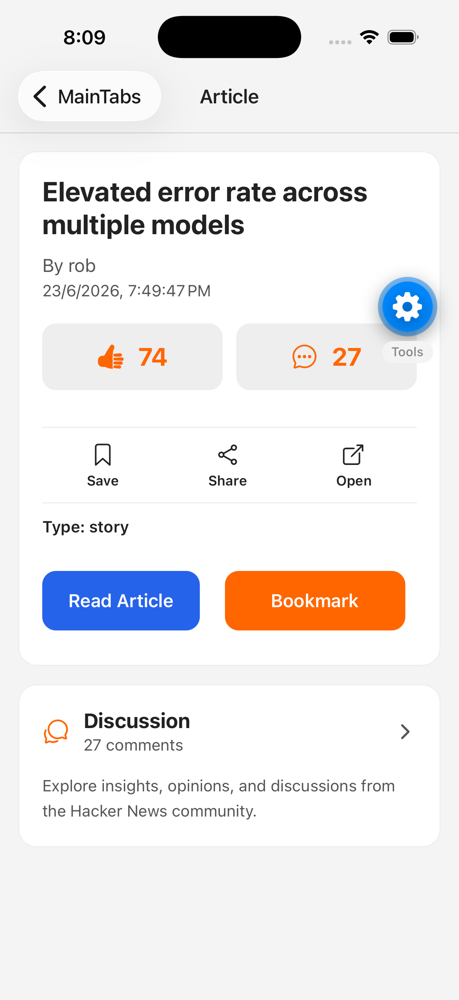
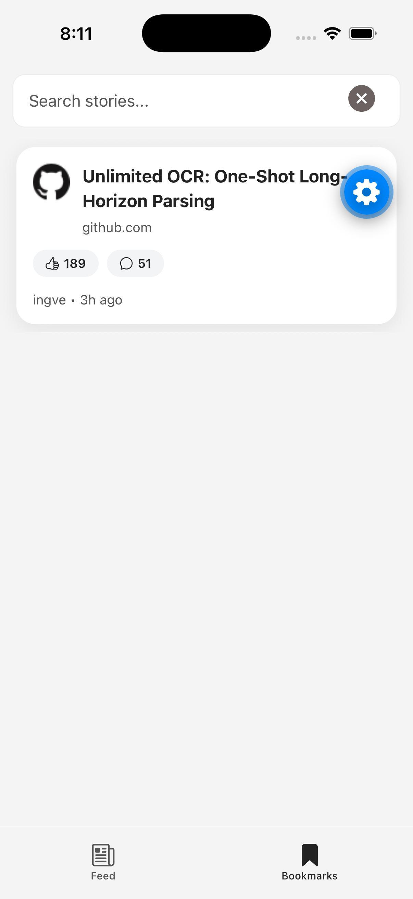
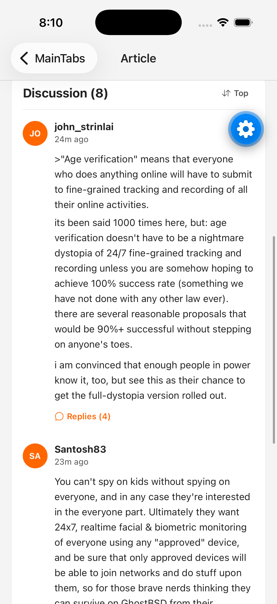
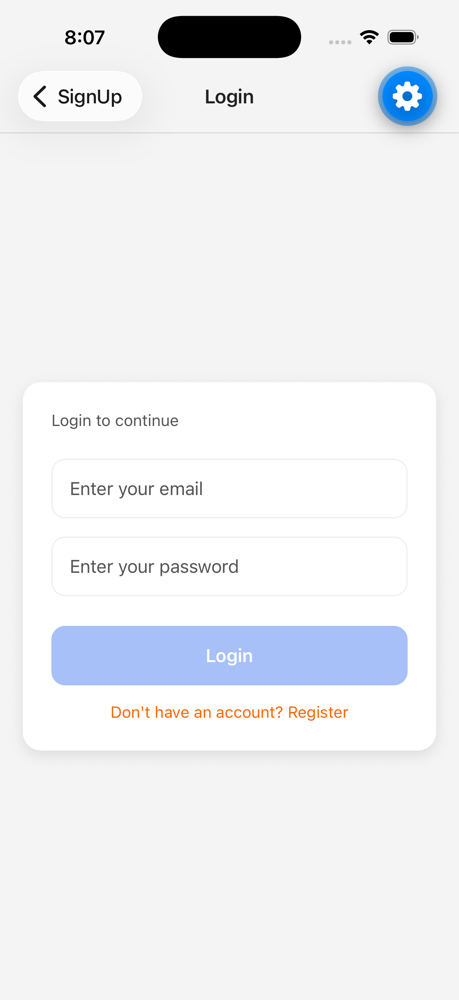

# DevFeed


DevFeed is a React Native news reader app built with Expo and TypeScript. It provides authenticated access to Hacker News-style stories, in-app article details, bookmarking, search, threaded discussion browsing, and AI-powered article summaries.

## 📥 Download

Download the latest Android APK from the **Releases** page.

➡️ [Latest Release](../../releases/latest)

---

## ✨ Features

- ✅ Firebase Authentication
- ✅ Hacker News Feed
- ✅ Infinite Scroll
- ✅ Search Stories
- ✅ Bookmarks
- ✅ Discussion Threads
- ✅ Dark / Light Theme
- ✅ Offline Indicator
- ✅ Pull to Refresh
- ✅ Share Stories
- ✅ AI Article Summary

---

## 🛠 Built With

- Expo / React Native
- TypeScript
- React Navigation
- Firebase Auth
- React Query
- AsyncStorage
- Expo Vector Icons

---

## Screens

## 📱 Android

<table align="center">
  <tr>
    <td align="center">
      <br/>
      <b>Home</b>
    </td>
    <td align="center">
      <br/>
      <b>Article</b>
    </td>
    <td align="center">
      <br/>
      <b>Bookmarks</b>
    </td>
  </tr>
  <tr>
    <td align="center">
      <br/>
      <b>Ai Summarization</b>
    </td>
    <td align="center">
      <br/>
      <b>User Management</b>
    </td>
  </tr>
</table>

## 🍎 iOS

<table align="center">
  <tr>
    <td align="center">
      <br/>
      <b>Home</b>
    </td>
    <td align="center">
      <br/>
      <b>Article</b>
    </td>
    <td align="center">
      <br/>
      <b>Bookmarks</b>
    </td>
  </tr>
  <tr>
    <td align="center">
      <br/>
      <b>Discussion</b>
    </td>
    <td align="center">
      <br/>
      <b>Login</b>
    </td>
  </tr>
</table>

---

## Getting Started

### Prerequisites

- Node.js
- npm
- Expo CLI
- Xcode or Android Studio if running on simulator/device

### Install

```bash
npm install
```

### Run

```bash
npm start
```

Then choose:

- `npm run android`
- `npm run ios`
- `npm run web`

---

## Firebase

The app uses Firebase Authentication in firebase.ts.

If you want to use your own Firebase project:

- create a Firebase app
- enable Email/Password authentication
- replace the `firebaseConfig` values in firebase.ts

---

## Project Structure

```text
src
├── features
│   ├── auth
│   ├── bookmarks
│   ├── discussion
│   └── feed
├── navigation
├── services
├── shared
│   ├── components
│   ├── hooks
│   └── utils
└── types
```

---

## Notes

- HomeScreen.tsx loads stories in pages and supports pull-to-refresh
- BookmarksScreen.tsx refreshes bookmarks when screen is focused
- StoryDetailsCard.tsx uses bookmark state and `Ionicons` action icons
- SearchBar.tsx includes a clear icon for quick search reset

---

## Future Improvements

- add full offline caching for story data
- improve discussion pagination for large threads
- add profile settings and logout confirmation
- enhance error handling across network requests
- extract environment config for Firebase and API endpoints

---
