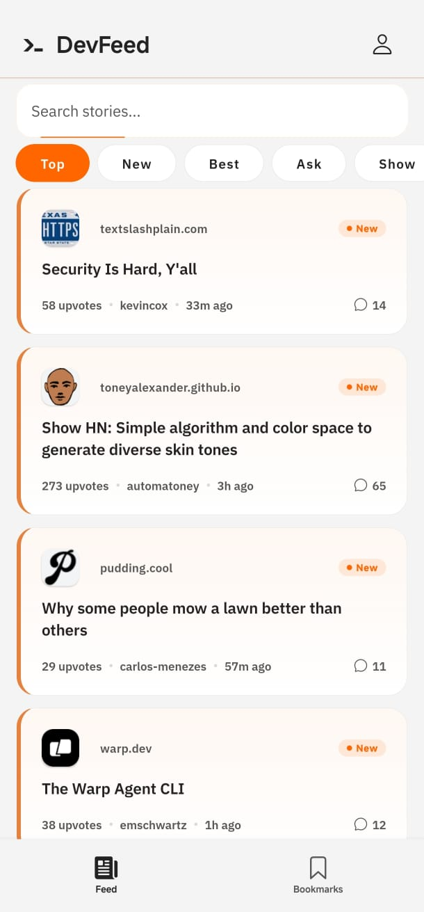
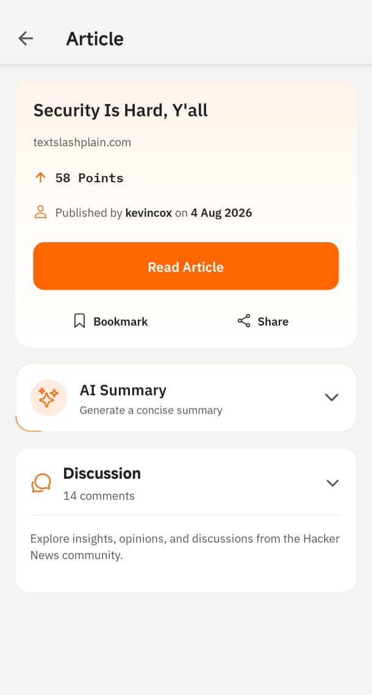
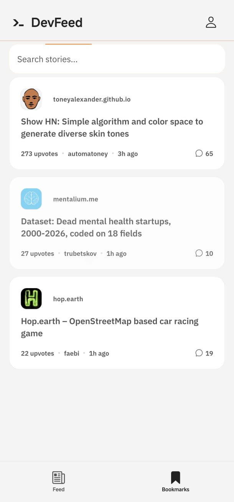
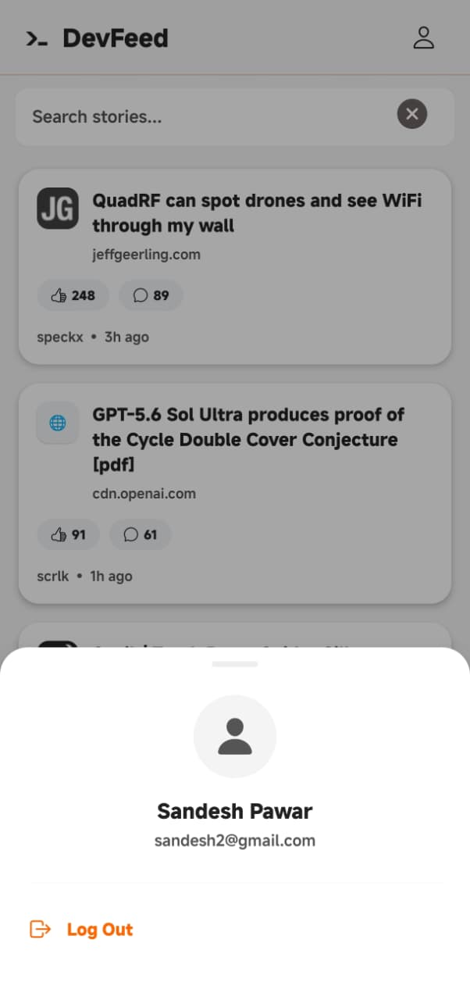
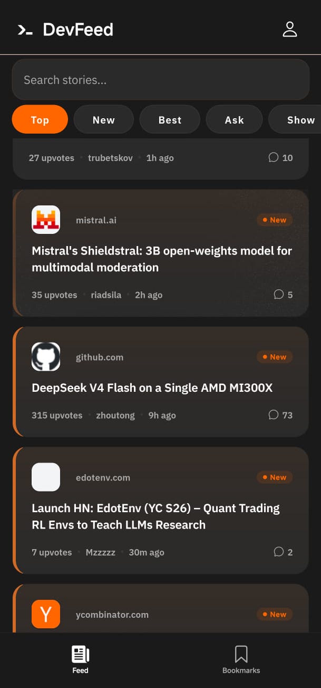
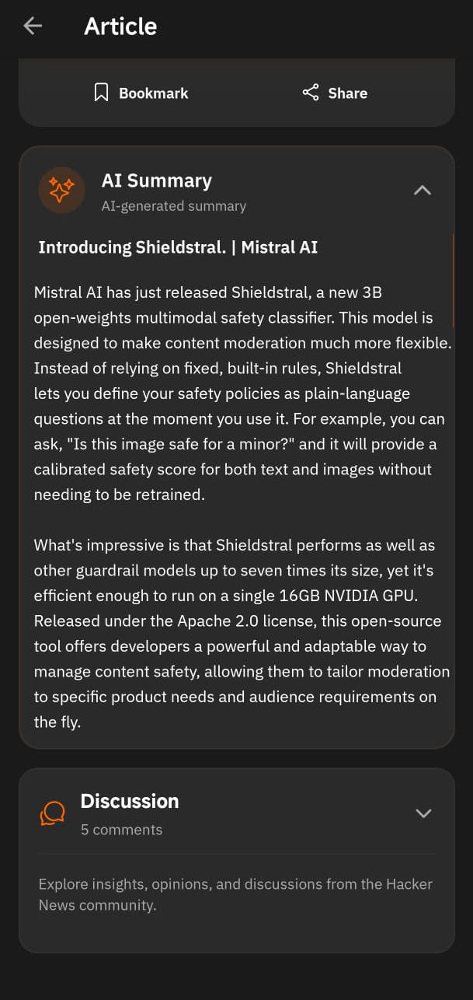
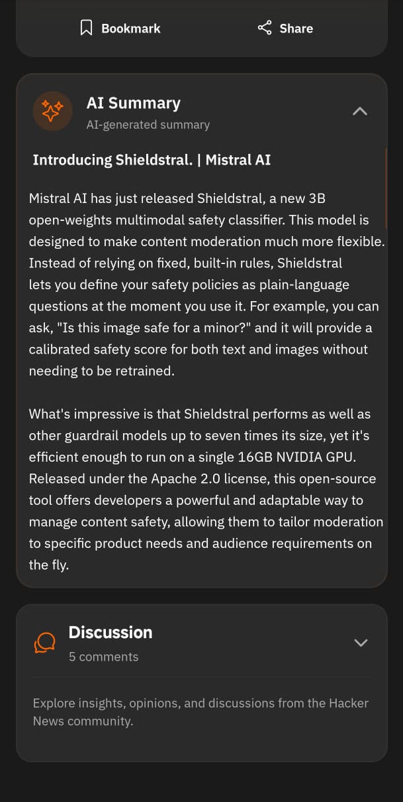
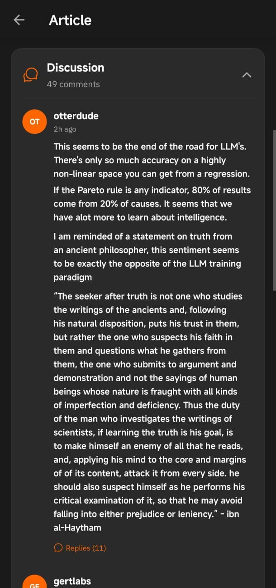

# DevFeed

DevFeed is a polished, mobile-first Hacker News client built with Expo and TypeScript. It brings together the speed of modern news browsing with the depth of community discussion, giving developers a focused way to discover, read, bookmark, and engage with tech stories from one elegant experience.

Whether you want to stay updated on startup launches, engineering insights, or the latest product releases, DevFeed makes it easy to consume content quickly and thoughtfully.

## Why DevFeed

This project is designed for users who want more than a basic feed viewer. It combines:

- a clean, modern reading experience
- fast browsing through Hacker News stories
- in-app article detail views and discussion threads
- personalized bookmarking and saved reading lists
- AI-powered summaries for quicker content consumption

It is built as a product-minded mobile app, not just a demo, with attention to usability, responsiveness, and a refined user experience.

## Key Features

- Authentication with Firebase for secure, personalized access
- Hacker News story browsing with infinite scrolling
- Pull-to-refresh and smooth content loading
- Search across stories for faster discovery
- Bookmarking for saving important posts
- Threaded discussion browsing for context and conversation
- Light and dark theme support
- Offline connectivity awareness
- Shareable article links
- AI-generated article summaries for quick digesting

## Product Experience

DevFeed is built around a simple idea: help readers stay informed without friction.

The experience includes:

- a streamlined home feed optimized for reading
- article detail screens with rich context and actions
- discussion views that preserve conversation flow
- lightweight interactions that feel native and responsive

## Tech Stack

- React Native + Expo
- TypeScript
- React Navigation
- Firebase Authentication
- React Query for data fetching and caching
- AsyncStorage for local persistence
- Expo Vector Icons and custom UI components

## Screenshots

### Light Mode

A bright, clean experience for everyday reading and discovery.

<table align="center">
  <tr>
    <td align="center">
       
      <b>Home Feed</b>
    </td>
    <td align="center">
       
      <b>Article Details</b>
    </td>
    <td align="center">
       
      <b>Bookmarks</b>
    </td>
  </tr>
  <tr>
    <td align="center">
       
      <b>AI Summary</b>
    </td>
    <td align="center">
       
      <b>User Management</b>
    </td>
  </tr>
</table>

---

### Dark Mode

A deeper, more immersive experience designed for low-light use.

<table align="center">
  <tr>
    <td align="center">
       
      <b>Home Feed</b>
    </td>
    <td align="center">
       
      <b>Article Details</b>
    </td>
    <td align="center">
       
      <b>AI Summary</b>
    </td>
  </tr>
  <tr>
    <td align="center">
       
      <b>Discussions</b>
    </td>
  </tr>
</table>

## Roadmap

Future improvements include:

- expanded offline caching for story content
- stronger discussion pagination and thread management
- profile settings and richer account controls
- improved error handling and resilience for network failures
- broader environment configuration for API and service integrations

## License

This project is licensed under the MIT License.
